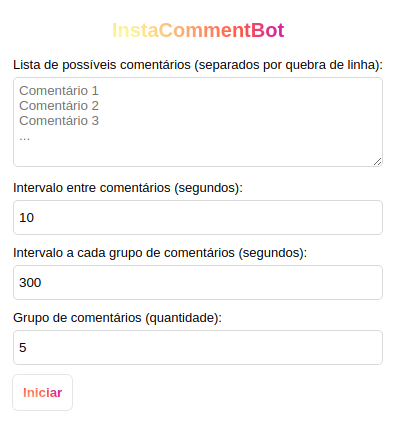
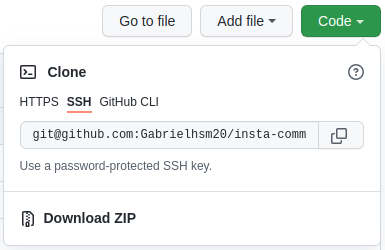

  
  

    Bot desenvolvido com o objetivo de colocar em prática conhecimentos adquiridos durante estudos relacionados à criação de extensão para navegador.
  

  
  
  
  

## 💻 Preview

  

## 🛠 Ferramentas

- HTML5
- CSS3
- Javascript

## 📂 Instalação

Faça o download do projeto clicando em "Code" e, posteriormente, em "Download ZIP, ou [clique aqui](https://github.com/Gabrielhsm20/insta-comment-bot/archive/refs/heads/master.zip):

  

Acesse o Gerenciador de Extensões do navegador (chrome://extensions/) e ative o Modo Desenvolvedor. Em seguida, clique em "Carregar sem compactação" e selecione a pasta onde foi extraído o projeto.

## 🚀 Utilização

Acesse o Post em que o Bot irá atuar, abra a extensão e preencha os campos:
- Lista de comentários (separados por quebra de linha)
- Intervalo entre comentários (segundos)
- Intervalo a cada grupo de comentários (segundos)
- Grupo de comentários (quantidade)

Então, clique em Iniciar.